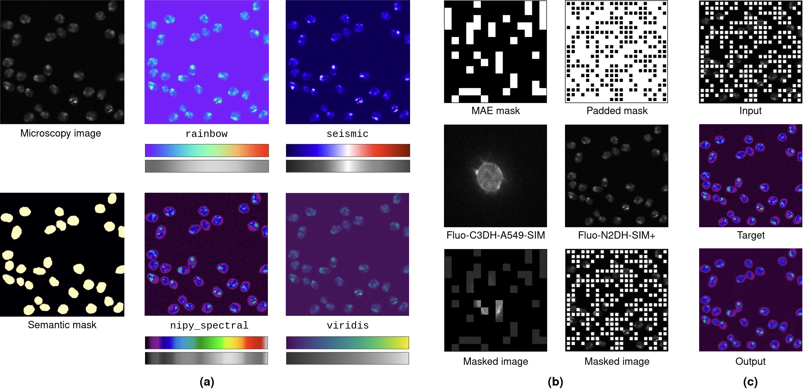

# Pseudo-colorize masked cells
TL;DR: Self-supervised pre-training method for cell detection, which combines masked autoencoding and pseudo-colorization.

(a) Pseudo-colorization of fluorescence microscopy images and the corresponding colormaps. 
(b) Masking schemes and masked fluorescence microscopy images. MAE masks cover 75\% of images, whereas our proposed padded masks contain smaller patches and cover 33\%. 
Image areas masked by our padded masking scheme are highlighted in white here to enhance their visibility. During pre-training, these areas are set to zero. 
(c) Proposed pre-training objective: Pseudo-colorize masked cells.

Pre-training demo using a ViT backbone, small patches and standard masking

Image size 384x384, Patch size 8x8, masking ratio: 0.33, pre-training target: fluorescence microscopy video pseudo-colorized with the nipy_spectral colormap

## Getting started
Coming soon...

## Fine-tuning on cell detection

Input fluorescence microscopy video, predicted centroid heatmaps, and detections (predicted bboxes in green, target bboxes in red)

## TensorFlow implementation
This [repo](https://github.com/roydenwa/cell-centroid-former) contains the code for our CellCentroidFormer model with an EfficientNet backbone.

## Acknowledgements
The code for vision transformer (ViT) models and masked autoencoders (MAEs) is based on lucidrain's [vit_pytorch](https://github.com/lucidrains/vit-pytorch) library.
